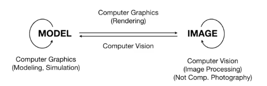

# 1. Overview of computer Graphics

## 1.1 application 

- **游戏** 
  - 判定画面是否好：是否足够亮（**全局光照**技术）
  - 如何形成**卡通风格**（无主之地3）
- **电影 ** 
  - 黑客帝国（**特效**）
  - 特效是最简单的图形学应用，而常见的东西更难做好
  - 阿凡达（**动捕**） 
- **动画** 
  - 疯狂动物城（**毛发**）
  - 几何，渲染，计算光线
  - 冰雪奇缘
  - （模拟、动画）光效粒子
- **设计** 
  - 渲染出的设计（如汽车，装修）
- **可视化** 
- **虚拟现实** 
- **数码插画（digital illustration）** 
- **模拟**  
- **GUI**  
- **字体（typography）** 
  - 放大之后依旧清晰（矢量图）

## 1.2 course topics (4 parts)

- rasterization 光栅化
  - 将三维空间的几何形体显示在屏幕上
    - 将形体拆成片段（像素点）
    - 实时：能达到 30fps/s，会广泛运用光栅化
    - 离线
- curves and meshes 曲线和曲面
- ray tracing 光追
- animation/simulation 模拟

## 1.3 计算机图形学与计算机视觉

 

