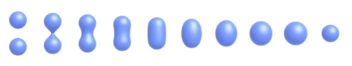

# L10 geometry

- 如何存储
- 如何渲染
- 远近和过渡

## 1. 分类

- implicit 隐式 
  - algebraic surface
  - level sets
  - distance functions
- explicit 显式
  - point cloud 
  - polygon mesh
  - subdivision, NURBS

### 1. 隐式曲面和显式曲面的特点

#### 1. 隐式曲面的定义

- 曲面上的点满足一定关系
- $x^2+y^2+z^2 = 1$ 
- 通常记为 $f(x,y,z) = x^2+y^2+z^2-1 = 0$ 
  - **容易判断点与曲面的关系** $f = 0$
  - **很难采样**到曲面上**具体的点** 

#### 2. 显式曲面的定义

 

- 点**直接给出**或者通过**参数映射**给出

  - 在平面上把所有点走一遍就能通过映射关系找到空间中点的坐标

- $f(u,v) = ((2+\cos u )\cos v, (2+\cos u) \sin v, \sin u)$ 

- $$
  x = (2+\cos u) \cos v \\
  y = (2+\cos u) \sin v \\
  z = \sin u
  $$

  ​	

  - 只需要输入 $(u,v)$ 值就能**得到曲面上的点** 
  - 但是**不好判断**点和曲面的**关系** 

#### 3. 优缺点

##### 隐式曲面

- 优点：

  - **简洁**的描述（如函数）

  - 某些查询很简单（如是否在物体内部，到表面的距离）

  - 适合做**光线求交**（ray-to-surface intersection）

  - 对于简单的形状，能够严格准确的描述

  - 很容易处理拓扑上的变化（如流体）

- 缺点：
  - 难以描述复杂模型

##### 显式曲面

### 2. 具体的隐式曲面

#### 1. 代数曲面 （algebraic surfaces）

 

- 复杂模型难以表示

#### 2. CSG（constructive solid geometry）

- 简单几何的**布尔运算** 
- 一定程度上缓解隐式曲面难以表现复杂形体的困境

 

 

#### 3. 符号距离函数 （SDF，signed distance function）

- **距离函数**：对于几何体，不描述其表面，而是描述空间内**任意一点到表面的最短距离** （可有正负，按照在物体内外划分）

 

 

- 阴影部分为物体
- 想要求出A→B的运动过程中的中间状态 / 单纯将两个不同的图做blending

- 对A，B两图来说，阴影部分右边界为表面，SDF为0，左侧为内部，SDF为负，右侧为外部，SDF为正
- 进行blend后，对两个SDF函数相加，得到SDF为0的部分即为表面，为负部分则为内部

 

#### 4. 水平集（Level Set Methods）

 

- 不像SDF会空间中的每一个点有一种严格的数学定义
- 而是对空间用一个个格子去近似一个函数
- 利用定义好的格子值进行双线性插值，得到任意一点函数值，找到 f(x)=0 的曲面
- 可以更加显示的区空间曲线的形状

#### 5. 分形（Fractals）

 

- 分型几何是指许许多多**自相似**的形体最终所组成的几何形状 
- 如雪花是一个六边形，放大之后会发现每一个边上又是一个六边形，再放大六边形边上的六边形边上又是六边形，就这样无限套娃，有点**递归**的意思 

### 3. 具体的显式曲面

#### 1. 点云（Point Cloud）

 

- 由一系列点表示
- 点越多模型的细节越多
- 适用于大规模的数据集
- 对于采样率较低的部分比较难以画出对应区域
- 通常研究如何将点云变为三角面片

#### 2. 多边形网格（Polygon Mesh）

 

- 存储点和多边形
- 更容易做处理
- 相对点云，结构更复杂
- 使用最多

