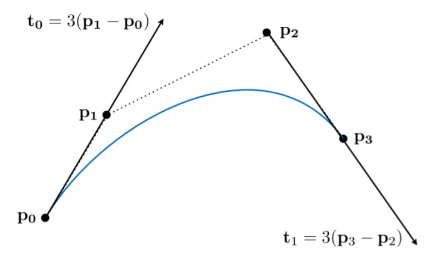
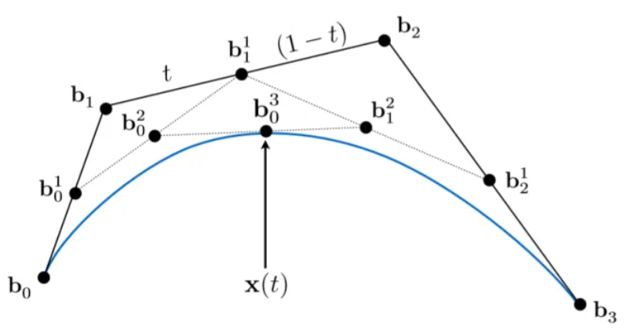
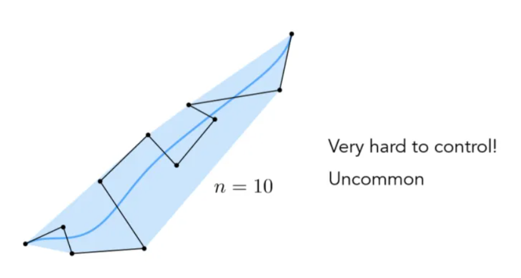
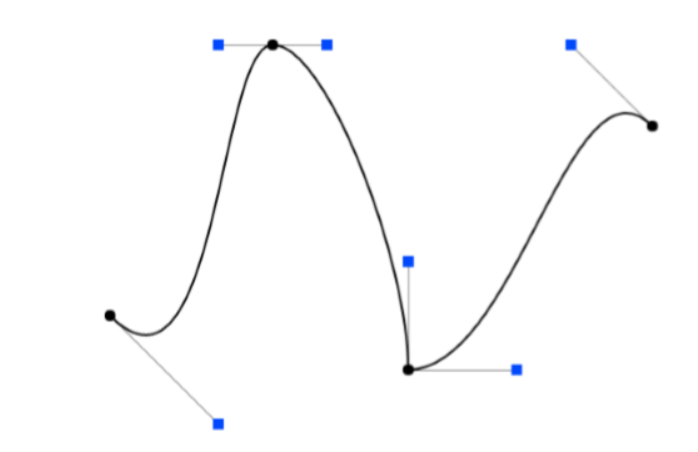
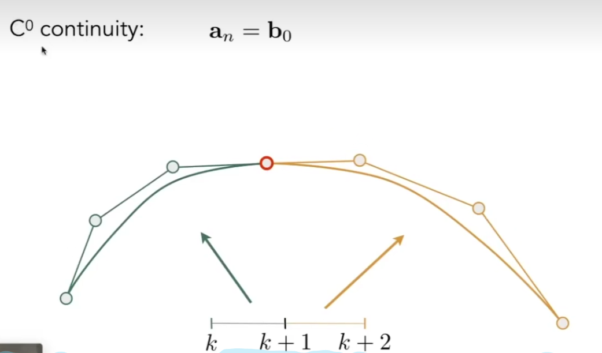
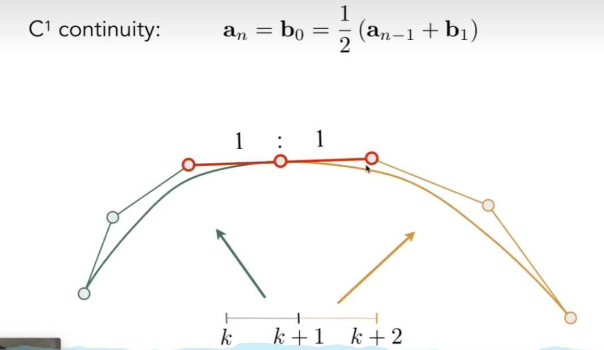
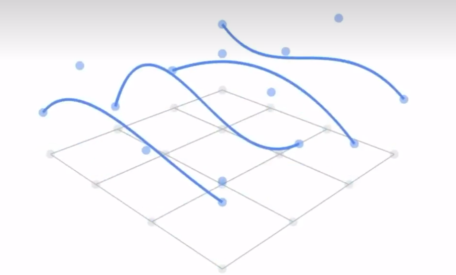
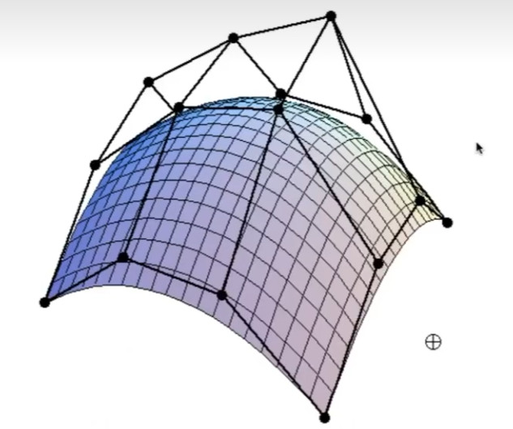

# L11 geometry（curve and surface）

## 1. 贝塞尔曲线（Bezier Curves）

### 1. 概述

 

由**若干个控制点**构成一条曲线，而曲线上任意一点用 $b(t)$ 表示，其中 $\  t \in [0, 1]$ 

参数方程，因此是**显式曲面** 

特点（例子以4个控制点的曲线为例）

- 曲线经过**起始点和终点**  
  - $b(0) = p_0, b(1) = p_3$ 

- 曲线与起始线段和终止线段**相切** 
  - $b'(0)=3(p_1-p_0), b'(1)=3(b_3-b_2)$ 

- **仿射变换**不变性
  - 对整条**贝塞尔曲线**做仿射变换 = 先对**控制点**做仿射变换，然后**生成贝塞尔曲线** 

- **凸包性质** 
  - 曲线一定不会超出所有控制点构成的多边形范围

### 2. 几何定义

 

### 3. 数学定义

- $b^n(t) = b^n_0(t) = \sum\limits_{i=0}^n b_i B_i^n(t) $  
  - $B_i^n(t) = \binom{n}{i}t^i(1-t)^{n-i}$   伯恩斯坦多项式
  - $b^n_m(t) = \sum\limits_{i=0}^n b_{i+m} B_i^n(t)$ 
- $b_0^1(t) = b_0(1-t) + b_1t$ 
- $b_0^2(t) = b_0(1-t)^2 + 2 b_1(1-t)t + b_2t^2 $ 

### 4. 逐段贝塞尔曲线（Piecewise）

  

- 控制点众多，很难控制局部的贝塞尔曲线形状
- 分段贝塞尔曲线，将一条高次曲线分成多条低次曲线的拼接
- 其中用的最多的是用3次曲线（4个控制点）来拼接

### 5. 连续

  

  

- 详情： https://zhuanlan.zhihu.com/p/437529481

### 6. 其他曲线

- 样条（spline）函数
  - basis spline 基函数样条
  - 更好进行局部控制

- 对于贝塞尔曲线
- 可以理解为用伯恩斯坦多项式在时间t它的不同项，对不同的控制点做加权平均
- 也可以理解为用控制点的位置对伯恩斯坦多项式进行加权求和
  - 这里伯恩斯坦多项式就可以视为基函数
- 贝塞尔曲线动一个点，整个曲线会发生变化，但有时我们只想在某个范围内的地方变化（局部性），且不需要分段，因此使用样条函数

## 2. 贝塞尔曲面

 

- 简单来说就是分别进行两轮贝塞尔曲线操作
- 构成下图所示的曲面

 

