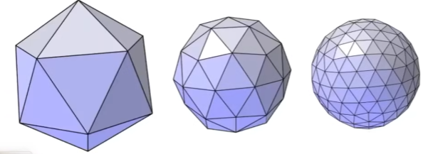
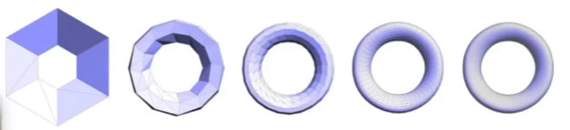
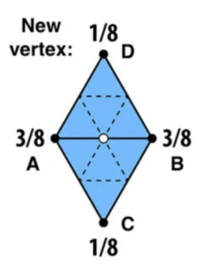
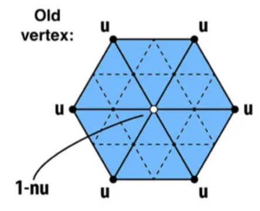
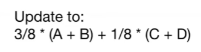
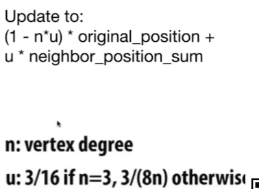
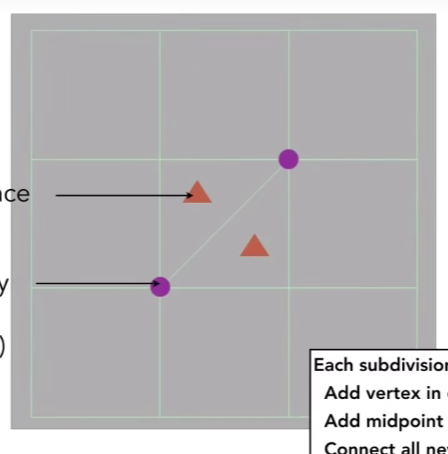
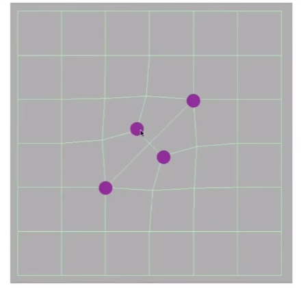
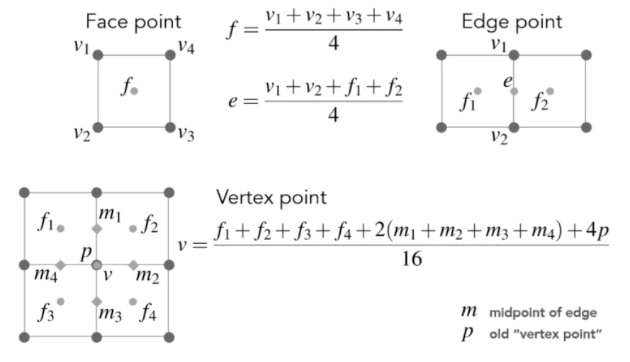
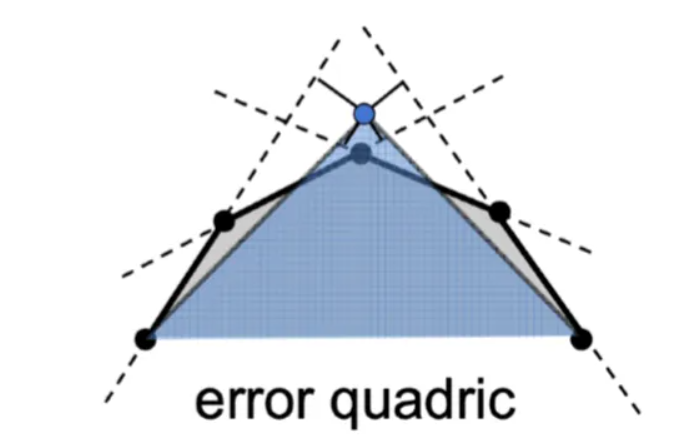

# L12 Geometry（mesh）

- Mesh Subdivision（upsampleing）
- Mesh Simplification（downsampleing）
- Mesh Regularization （same triangles）

## 1. 曲面细分 （Mesh Subdivision）

 

- 应用
  - 位移贴图，从物理层面改变顶点的高度，这时需要用很多三角形才能赶得上纹理的频率
- 过程
  1. 创建更多三角形
  2. 改变点的位置
     - 会变得光滑

### 1.1 Loop Subdivision（only triangle）

- 将每个三角形分为4个

.assets/image-20221124160638577.png) 

- 调整三角形的位置
  - 新旧顶点的更新方式不同

 

| New vertex                                                   | Old vertex                                                   |
| ------------------------------------------------------------ | ------------------------------------------------------------ |
|  |  |
|  |  |
|                                                              | $n\ne3$时，原坐标始终占$\frac5 8$，其他点占比逐渐减少        |

### 1.2 Catmull-Clark Subdivision（General Mesh）

#### 1. 过程

- 增加面
  - 每个面增加一个顶点
  - 每条边增加一个中点
  - 连接所有新的顶点

   

- 坐标更新
  - 新顶点
    - 面顶点：周围4个顶点的平均
    - 边中点：周围2个边顶点和2个面顶点的平均
  - 旧顶点：4个面顶点、4个边中点和自身的平均

 

#### 2. 理解 

##### 定义

- 四边形面 / 非四边形面
- 奇异点 （$degree \ne 4$） / 非奇异点 （$degree = 4$） 

##### 性质

- **第一次**细分后**所有面**都会变成**四边形** 
- 有几个**非四边形面**，就会增加几个**奇异点** 
- 新增加的**奇异点的度数**与原来**面的边数**相等 

## 2. 曲面简化（Mesh Simplification）

### 1. 边坍缩（Collapse）

#### 1. 二次误差度量（Quadric Error Metrics）

 

- **新顶点**到原来各个相关的**三角面片所在平面**的**平方和距离**最小
- 如图为二维例子，此时顶点到4条边所在直线的平方和距离最小

#### 2. 过程

.assets/image-20221125110212279.png) 

1. 为模型每条边赋值，其值为坍缩这条边之后，代替两个老顶点的新顶点所能得到的最小二次误差度量
2. 选取权值最小的边做坍缩，新顶点位置为原来计算得出使得二次误差最小的位置
3. 坍缩完之后，与之相连其他的边的位置会改动，更新这些边的权值
4. 重复上述步骤，直到到达终止条件

- 贪心算法
- 使用堆结构