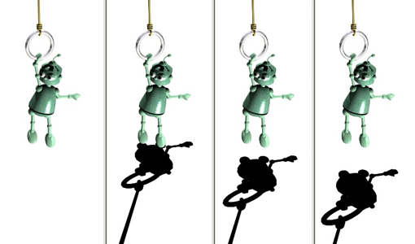
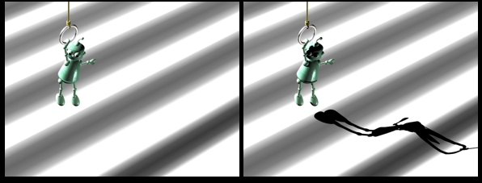
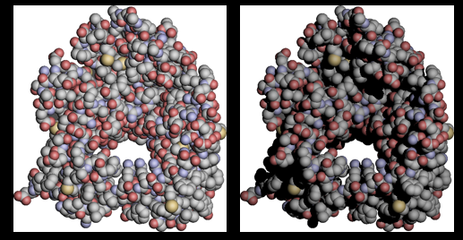
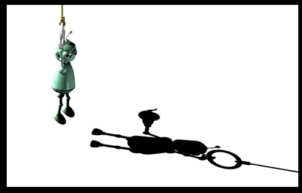
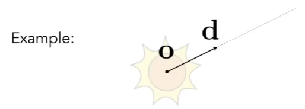

# L13. ray tracing

## 0. shadow mapping

### 1. 概述

- 光栅化中，**着色**是**局部**的现象，只考虑着色点、光源、摄像机，解决不了阴影的问题
- 因此考虑使用 shadow mapping 来实现阴影
- **思想** 
  - 如果点**不在**阴影里，那么这个点能被**光源**和**摄像机**同时看到
  - 如果**能被摄像机**看到，但是**不能被光源**看到，则有**阴影** 
  - 通过**深度图**实现
- 阴影的作用
  - 帮助理解位置和大小
  - 判断是否是凹凸不平
  - 帮助理解物体本身的结构
  - 看到一些本来看不到的东西

|  |  |  |  |
| ------------------------------------------------------------ | ------------------------------------------------------------ | ------------------------------------------------------------ | ------------------------------------------------------------ |

- 硬阴影算法除了基于图像的 shadow map 还有基于几何的 shadow volume

### 2. 过程

1. 把**光源当做摄像机**，**渲染**整个场景，然后得到**深度 buffer** $d_{map}$ 
2. 用真正的**摄像机**去**渲染**场景 
3. 将所有**摄像机视角下**的**可见点**，利用投影矩阵**投影**回光源，得到**光源视角**下的**屏幕坐标**，比较 $d_{max}$ 和可见点投影回光源的实际深度值
   - 如果两深度值相等，说明被光线照射，不在阴影中
   - 如果两深度值不等，说明有物体遮挡，在阴影中

### 3. 问题

- 传统的 shadow mapping 只能处理**点光源**  （硬阴影）
- 质量依赖于阴影贴图的分辨率
  - 游戏中的阴影质量
- 浮点精度造成的问题
  - 判断大小/使用bias
  -   

### 4. 硬阴影和软阴影

 

## 1. Whitted-Style Ray Tracing

### 1. Why Ray Tracing

- **光栅化**不能很好的处理**全局**效果 
  - 软阴影 
  - 当环境中**光线反复弹射**时难以处理 
- **光栅化**效率高，但是**质量低** 
  - real-time 
- **光追准确**，但效率低 
  - offline 

### 2. Basic Ray-Tracing Algorithm 

#### 1. Light Rays

- 沿直线传播
- 光线不会发生碰撞
- 光路可逆（中途可发生反射和折射）

#### 2. Ray Casting

- Pinhole Camera Model 

1. 从**人眼或摄像**机向**投影平面**上的**每一个像素点**发射一条光线
2. 找到光线的**最近交点** 
3. **连接交点和光源**，通过判断连线之间是否有物体判断交点**是否在阴影**中
4. 计算交点着色，**写回像素** 

 

### 3. Recursive（Whitted-Style）Ray Tracing

- 考虑多次反射和折射
- 如果达到漫反射镜面，考虑光线被吸收
- **每一个**交点的颜色贡献来自这样种几类型
  - **直接光照** 
  - **反射方向间接光** 
  - **折射方向间接光** （如果有折射）

  

- **递归**的思想
  - 伪代码如下

 

## 2. Ray Intersection

### 1. Ray Equation

 

- $\bold r(t) = \bold o + t\bold d \quad 0 \le t < \infty$ 
  - $\bold r$ ：光线
  - $t$ ：时间/长度
  - $\bold o$ ：原点
  - $\bold d$ ：方向（单位化）

### 2. Ray Intersection with Implicit Surface

- 隐式曲面：$\bold p: f(\bold p) = 0$ 
- 代入方程：$f(\bold o+t\bold d) = 0$ 
- 求解**正实数**解 $t$ 

### 3. Ray Intersection with Triangle Mesh

#### 1. 平面方程

1. **表示平面** 
   - $\bold p:(\bold p - \bold p')\cdot \bold N = 0$ 
   - 平面上**任意一点**到平面上某一点的向量点乘**法向量**为0
2. **求交** 
   - 将光线方程代入平面方程，求解
   - $(\bold o + t\bold d -\bold p')\cdot\bold N = 0$ 
   - 解出 $t = \frac{(\bold p'-\bold o)\cdot \bold N}{\bold d\cdot \bold N}$   
   - $0 \le t < \infty$ 
3. **是否在三角形内** 
   - 使用**重心坐标**计算

#### 2. faster way

 

- 建立方程：**光线**方程 = **重心坐标**方程
- 使用**克莱姆法则**直接解出结果
- 判断**是否满足解** 
  - t **非负实数**解
  - 重心坐标**参数全为正** 

