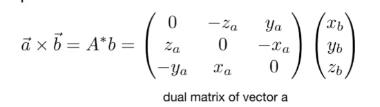

# 2. linear algebra

## 2.1 dependence

- basic mathematics
  - linear algebra
  - calculus
  - statistics
- basic physics
  - optics
  - mechanics（力学）
- misc
  - signal processing
  - numerical analysis

## 2.2 vector

- 图形学中用**单位向量**表示**方向** 
- 默认**列向量** 

### 1. dot product

 

- 主要用于计算夹角 
  - $cos\theta = \frac{\vec a\vec b}{\Vert a\Vert\Vert  b\Vert}$ 
    - $cos\theta = \hat a \hat b$ 
  - projection 
    - $\vec b_\perp = k \hat a$ 
    - $k = \Vert b\Vert cos \theta$ 
  - 利用点乘正负判断方向（正、反、垂直）

### 2. cross product

#### 1. 基础

- 计算法向量
- **右手定则**  （构建右手系）
- $\Vert \vec a \times \vec b \Vert = \Vert \vec a \Vert\Vert\vec b \Vert sin\theta$ 

 

#### 2. 用途

##### 1. 判断左/右

 

$a,b$ 向量在 $xOy$ 平面，则 $\vec a\times \vec b >0$ 则 $b$ 在 $a$ 左侧

##### 2. 判断内/外

 

$AB \times AP,BC\times BP,CA\times CP>0$ 则在内部

或者三次判断都**同号** 

## 2.3 matrix

### 1. 矩阵相乘

$(M\times N)(N\times P) = (M\times P)$ 

### 2. 向量换为矩阵相乘

$\vec a \cdot \vec b = \vec a^T \vec b$ 

 

对偶矩阵