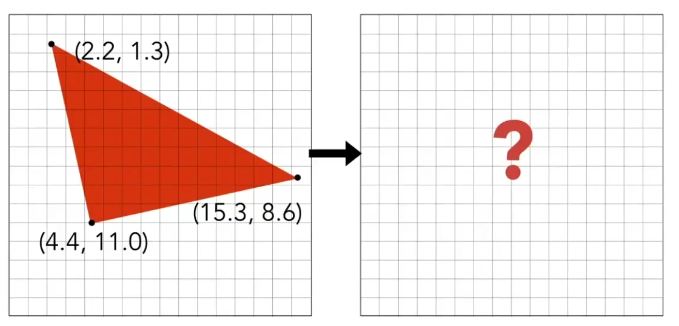
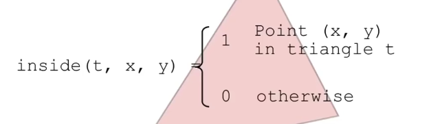
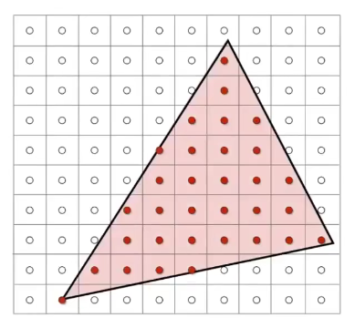
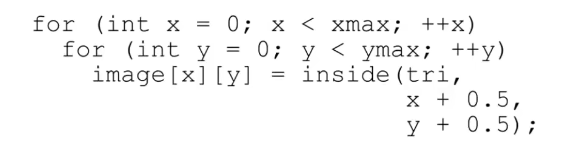
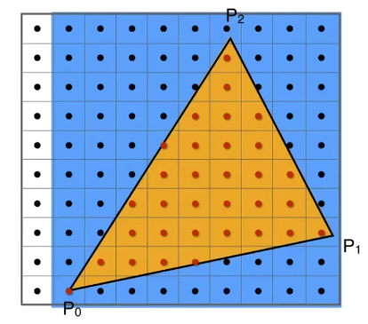
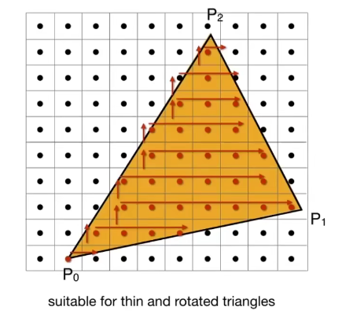

#  L5 rasterize（triangle）

## 1. 屏幕坐标及视口变换

- raster = screen
- rasterize = drawing onto the screen

屏幕坐标

.assets/L8aW71jvBQoM63A.png) 

- 像素 $(x,y)$ 
- 像素中心 $(x+0.5,y+0.5)$ 
- 范围 $(0,0) \ to\ (width,height)$ 

视口变换

.assets/bMLrHu3NFBdGK7Y.png) 

## 2. triangle mehses

polygon meshes 多边形网格

triangle meshes 三角形网格

why triangle？

- most basic polygon
- break up other polygons
- unique properties
  - guaranteed to be planar 
  - well-defined interior 
  - well-defined method for interpolating values at vertices(顶点) over triangle (barycentric interpolation 重心插值 )

what pixel values approximate a triangle？

 

如何判断一个点是否亮？

判断像素和三角形的位置关系，也即像素中心点与三角形的位置关系

## 3. sampling

方法 sampling （采样）

discretize a function(离散化) 

如果像素点中心在三角形内则发光

 

 

 

inside 函数

$AB,AP;BC,BP;CA,CP$ 叉乘同号则在内部（按顺序循环则可以，如ABC/ACB） 

边界（上边和左边优先）

是否检查所有像素？

否，利用 axis-aligned bounding box(包围盒，AABB)，即一个矩形区域 

 

Incremental triangle traversal

 

适用于斜着的细长的三角形

